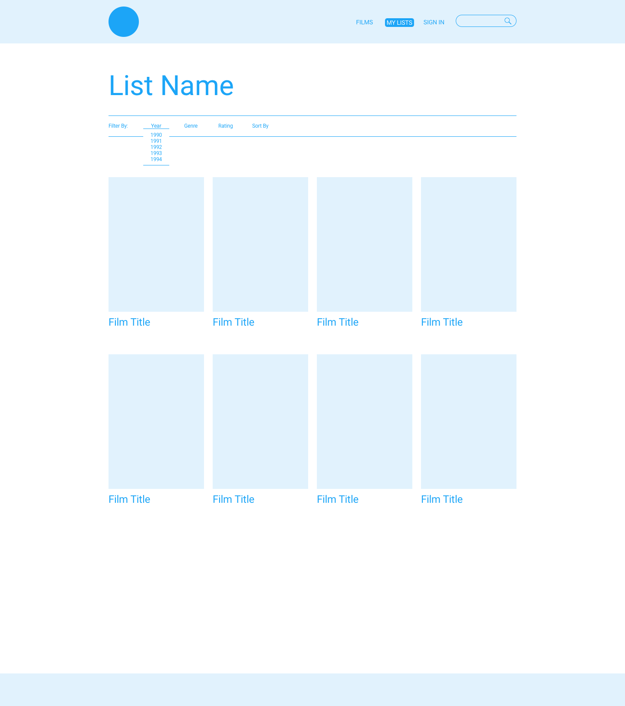
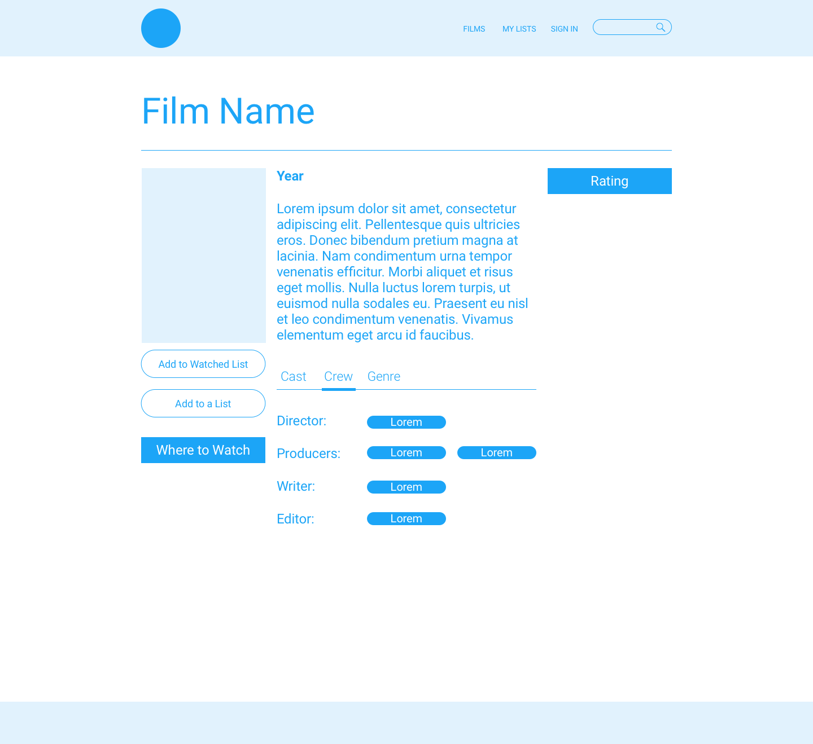

# ReelVue
Project #1 for Tucson Coding Bootcamp

### Description
Our application provides information to movie fans regarding their favorite
movies and movies that are currently playing in theaters. Information provided
to the user includes; the year the movie was made, it's rating, a short synopsis,
where to stream/watch (if available), industry and critic reviews, and cast and
crew credits.

### Motivation
We were motivated to provide a place to learn about movies we may be interested
in watching and sharing with others. We also wanted to know WHERE we could watch
these films. This application had to be user friendly and easy to use.

### Result
Using themovieDB.com, OmDB, and UTelly APIs to gather data about movies, as well
as the Skeleton CSS framework to assist in the layout, we were able to create a
user friendly movie database that will give you a short synopsis of a movie,
provides reviews and provides links to streaming services (if available).

### Team Efforts
Apple and Dillon’s responsibility was centered mostly around the front end and
click events. Dillon introduced the group to SASS, a CSS preprcessor that
simplified the task of styling the application. Gabe and Kenny were responsible
for writing the JavaScript that integrated with the API’s we selected.

### Challenges
One of the biggest challenges we found early on was finding a dependable API
that we could utilize for our application. Many of the API’s we wanted to use
are either closed to commercial use only or required a subscription. We also
discovered that some of the features that we would have liked to include in the
application, like user created lists and a login feature could not be included as
time became a constraint late in the project. Eventually, we agreed on the
application that you see before you.

### Improvements
Future improvements would allow us to introduce a user interface that allows
them to login and create lists of movies for them to watch later. We would also
like to integrate our “In Theaters Now” feature to include a link to buy movie
tickets.

### Process
A look at what we envisioned the project to look like

